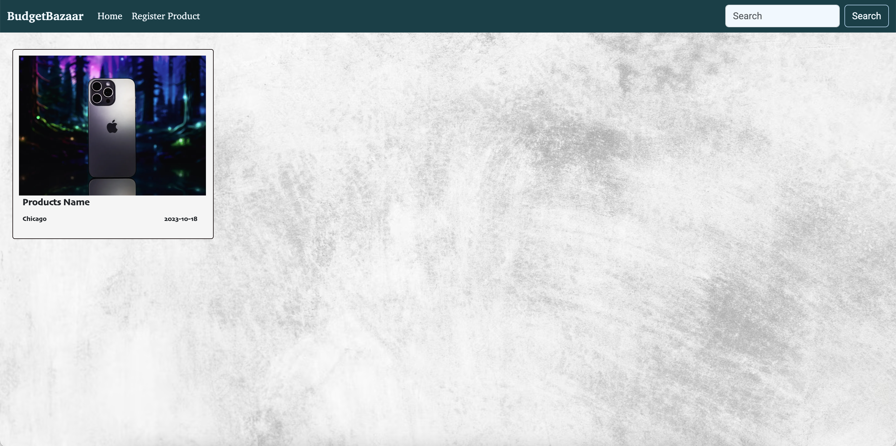
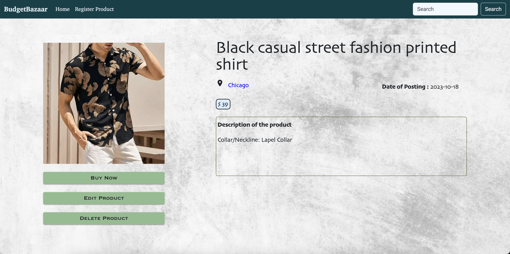
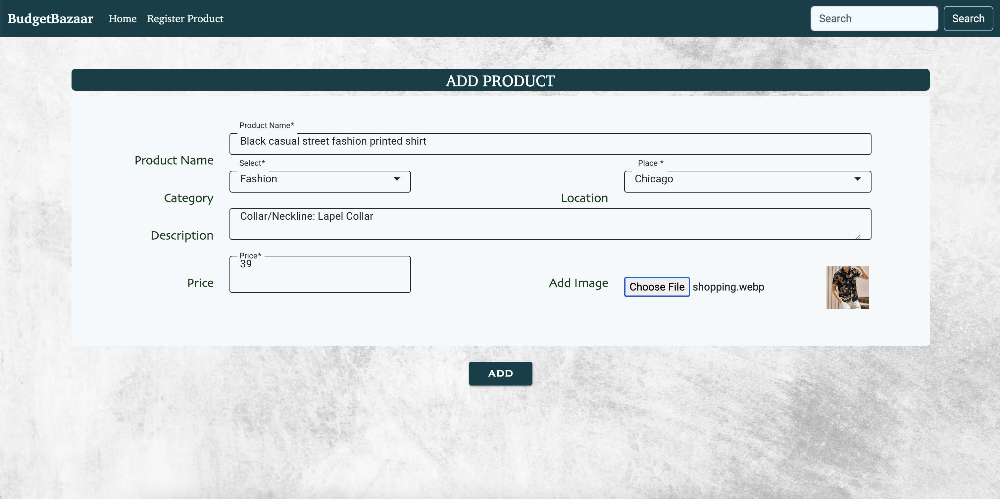
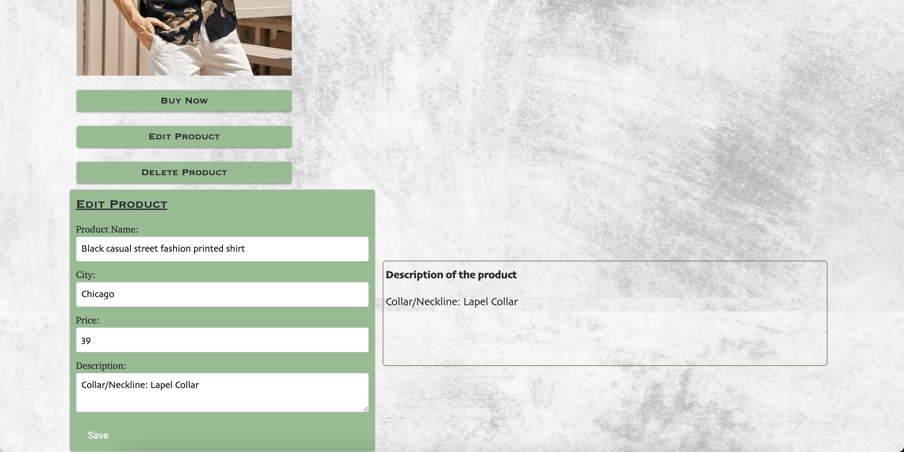

## Project Name: BudgetBazaar

### Description:
BudgetBazaar is an online e-commerce platform that specializes in offering a wide range of affordable products and goods to budget-conscious shoppers.

### Technologies Used:
* Angular
* CSS
* HTML
* JavaScript
* Bootstrap
* Netlify (deploy)

### Links:
* [Backend Repo](https://github.com/mrunaleepatel/finalProjectBackend.git)
* [Frontend Repo](https://github.com/mrunaleepatel/finalProjectFrontend.git)
* [Deployed App](https://main--fascinating-pika-3500f2.netlify.app)

### Features:
* Show a list of products
* Add products
* Edit products
* Delete products

### IDE Used:
- Visual Studio Code

### Learning tool:
I used (https://spring.academy and https://www.baeldung.com) courses to learn Spring Boot, Spring Security, Spring Data JPA, MySQL and for Angular I used (https://angular-university.io/home).

### Screenshots:
* 
* 
* 
* 

This project was generated with [Angular CLI](https://github.com/angular/angular-cli) version 16.2.5.

## Development server

Run `ng serve` for a dev server. Navigate to `http://localhost:4200/`. The application will automatically reload if you change any of the source files.

## Code scaffolding

Run `ng generate component component-name` to generate a new component. You can also use `ng generate directive|pipe|service|class|guard|interface|enum|module`.

## Build

Run `ng build` to build the project. The build artifacts will be stored in the `dist/` directory.

## Running unit tests

Run `ng test` to execute the unit tests via [Karma](https://karma-runner.github.io).

## Running end-to-end tests

Run `ng e2e` to execute the end-to-end tests via a platform of your choice. To use this command, you need to first add a package that implements end-to-end testing capabilities.

## Further help

To get more help on the Angular CLI use `ng help` or go check out the [Angular CLI Overview and Command Reference](https://angular.io/cli) page.
